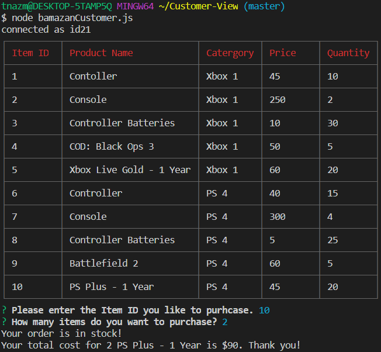
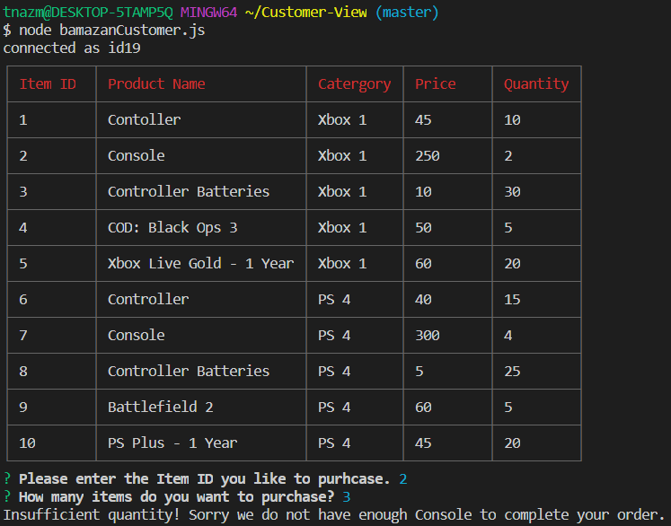

# Customer's View

## Instructions

In this project, you will be looking at an Amazon-like storefront. The app will take in orders from customers. The prompt will ask you to type a number that is from the "Item ID" section (1-10) in the table. Then it will give you another prompt about the amount of items you want. 

* If the number you choose is lower or equal than what's display in the "Quantity" section, you get a message saying "Your order is in stock!".

* If the number you choose is higher than what's display in the "Quantity" section, you get a message saying "Insufficient quantity!".

